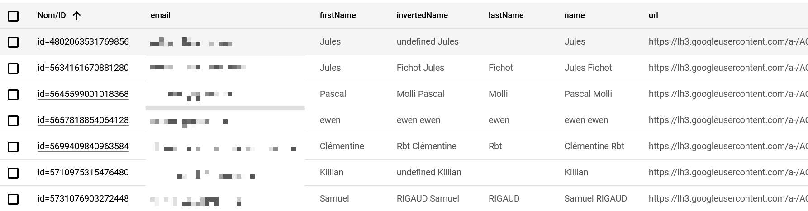
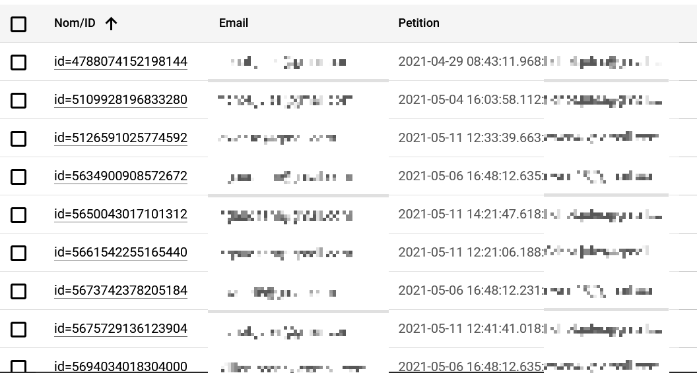
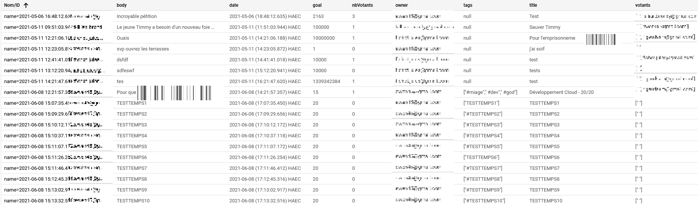

# Projet TinyPet

Ce projet a été réalisé par Jules FICHOT, Ewen GIBOIRE et Killian BRONDY dans le cadre du module de Développement Cloud enseigné par M. Pascal MOLLI en MASTER 1 MIAGE à l'Université de Nantes.

L'objectif de ce projet est de réaliser une application web de gestion de pétitions en manipulant des technologies Cloud, dans notre contexte Google Cloud Platform et plus particulièrement Google App Engine et le Datastore.

Les fonctionnalités devront être similaires aux sites tels que : https://secure.avaaz.org/community_petitions/fr ou https://www.change.org/

## Les liens

Voici les différents liens utiles afin de parcourir l'application, son API et son code.

* Lien vers [l'application](https://light-result-300815.appspot.com/) 
* Lien vers le [portail de l'API](https://endpointsportal.light-result-300815.cloud.goog/) 
* Lien vers le [Github](https://github.com/Lordnewe/TP-WEBANDCLOUD/)

## Consignes - Cahier des charges

Voici la liste des fonctionnalités à développer :

* Un utilisateur doit pouvoir créer une pétition
* Un utilisateur doit pouvoir signer une pétition (il ne doit pas pouvoir signer plusieurs fois et doit être authentifié)
* Un utilisateur doit pouvoir lister ses pétitions signées triées par date de signature
* Lister les 100 pétitions les plus signées triées par date de création
* Optionnel : Un utilisateur doit pouvoir rechercher des pétitions par tags

## Les fonctionnalités développées

* Un utilisateur peut créer une pétition ✅
* Un utilisateur peut signer une pétition (une seule fois et doit être authentifié) ✅
* Un utilisateur peut afficher le top10 des pétitions ✅
* Un utilisateur peut supprimer une pétition qu'il a créé
* Un utilisateur peut lister ses pétitions créés triées par date de signature ✅
* Un utilisateur peut lister ses pétitions signées triées par date de signature ✅
* Un utilisateur peut rechercher des pétitions par tags ✅
* Un utilisateur peut rechercher des pétitions par titre ✅
* Un utilisateur peut afficher la liste des signataires d'une pétition ✅

Nous avons testé ces fonctionnalités en utilisant différents navigateurs web sans déceler d'anomalie.

## Les corrections possibles
* La recherche par tags devrait se faire même sur plusieurs tags.

## Les évolutions possibles
* La recherche par titre pourrait être simplifiée s'il ne fallait pas respecter la casse.
* Des popups afin que l'utilisateur sache s'il a bien supprimé une pétition, s'il a bien voté ou enlevé son vote sur une pétition.

## Moyenne des temps de réponse

Nous avons réalisé des calculs sur le temps de réponse de deux requêtes que nous avons jugé importantes et intéressantes : le temps de la requête GET pour récupérer le top 10 des pétitions et le temps de la requête POST pour créer une pétition.

Nous avons vérifié les temps de réponse grâce à la console Firefox dans l'onglet "Réseau".
Chaque requête a été lancé 10 fois en désactivant le cache.
Ces tests nous permettent de vérifier que les temps de réponse sont bien inférieurs à 500 ms.f

### Affichage du top 10 des pétitions - Requête GET

Voici la liste des essaies numérotés avec le temps de réponse correspondant :

1. 470 ms
2. 275 ms
3. 158 ms
4. 99 ms
5. 98 ms
6. 160 ms
7. 82 ms
8. 101 ms
9. 240 ms
10. 114 mss
La moyenne est de 179,7 ms. 

### Création d'une pétition - Requête POST

Voici la liste des essaies numérotés avec le temps de réponse correspondant :

1. 65 ms
2. 90 ms
3. 105 ms
4. 65 ms
5. 69 ms
6. 62 ms
7. 65 ms
8. 64 ms
9. 66 ms
10. 61 ms

La moyenne est de 71,2 ms.

## Capture d'écran des entités utilisées

### User

### Sign

### Petition

## Aperçus de l'application

Voici quelques captures d'écran du site développé.

### Page d'accueil

### Résultats de la recherche

### Mes pétitions signées

### Mes pétitions crées

### Création d'une pétition

### La liste des signataires
